# **Розробка та оцінка GAN для відновлення зображень**

## **Мета**
Розробити та налаштувати GAN для задачі відновлення зображень, зокрема для:
1. Збільшення роздільної здатності.
2. Відновлення пошкоджених зображень.

Оцінити ефективність моделей за допомогою метрик:
- PSNR (Peak Signal-to-Noise Ratio).
- SSIM (Structural Similarity Index).

---

## **Вибір датасету**

Ми обрали **CIFAR-10** з таких причин:
1. **Розмір:** CIFAR-10 є невеликим за обсягом (60 000 зображень), що спрощує навчання та тестування.
2. **Простота:** CIFAR-10 містить зображення розміром 32x32, які легко масштабувати до 128x128 для задачі відновлення.
3. **Доступність:** CIFAR-10 легко завантажується через `torchvision`, на відміну від CelebA, який потребує додаткових інструментів для завантаження.

---

## **Архітектура GAN**

### **Генератор**
Генератор приймає вхідні зображення низької роздільної здатності (32x32) та відновлює їх до високої роздільної здатності (128x128).

#### Особливості:
- **Транспоновані згорткові шари** (`ConvTranspose2D`) для збільшення роздільної здатності.
- **Нормалізація пакетів** (`BatchNorm2D`) для стабільності тренування.
- **Функції активації:**
  - `ReLU` для прихованих шарів.
  - `tanh` для вихідного шару.

### **Дискримінатор**
Дискримінатор класифікує, чи є зображення реальним чи згенерованим.

#### Особливості:
- **Згорткові шари** (`Conv2D`) для витягу ознак.
- **Функції активації:**
  - `LeakyReLU` для прихованих шарів.
  - `sigmoid` для класифікації.

---

## **Функції втрат та оптимізація**

1. **Дискримінатор:**
   - Втрати: `Binary Cross-Entropy Loss` (BCELoss).
   - Оптимізатор: `Adam` із коефіцієнтом навчання `1e-4`.

2. **Генератор:**
   - Втрати:
     - `Mean Squared Error` (MSE) для відновлення зображення.
     - Adversarial Loss для обману дискримінатора.
   - Оптимізатор: `Adam` із коефіцієнтом навчання `1e-4`.

---

## **Звіт: Навчання та оцінка моделі GAN**

### **Навчання**
Моделі тренувалися з такими параметрами:

- **Кількість епох**: 50
- **Розмір батчу**: 16
- **Розмір зображень**: Вхідні зображення були зменшені до 32x32, а вихідні масштабовані до 128x128.
- **Збереження моделей**: Моделі зберігалися після кожної епохи у форматі:
  - `generator_epoch_{номер}.pth`
  - `discriminator_epoch_{номер}.pth`

---

## **Файли проекту**

### **Основні файли:**
```plaintext
train.py            # Код для навчання GAN
evaluate.py         # Код для оцінки моделей (GAN і SRGAN)
generator.py        # Архітектура генератора
discriminator.py    # Архітектура дискримінатора
srgan.py            # Архітектура генератора SRGAN (опціонально)
```

# **Порівняльний звіт: Оцінка якості моделі GAN**

## **Таблиця метрик PSNR та SSIM**

| Епоха | PSNR    | SSIM   |
| ----- | ------- | ------ |
| 1     | 17.4899 | 0.7337 |
| 2     | 14.7227 | 0.8234 |
| 3     | 20.4272 | 0.8914 |
| 4     | 22.0976 | 0.9126 |
| 5     | 18.8058 | 0.7790 |
| 6     | 20.8179 | 0.9182 |
| 7     | 23.3236 | 0.9427 |
| 8     | 22.7589 | 0.9459 |
| 9     | 23.6007 | 0.9342 |
| 10    | 22.3043 | 0.9427 |

---

## **Візуальне порівняння відновлення зображень**

### **Епоха 1**
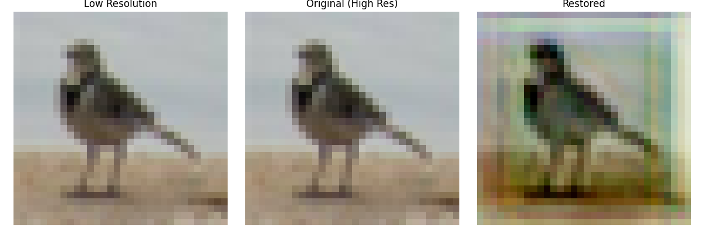
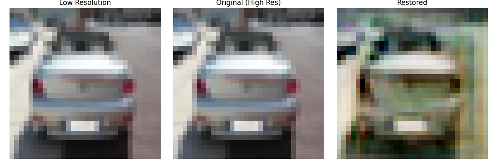

### **Епоха 2**
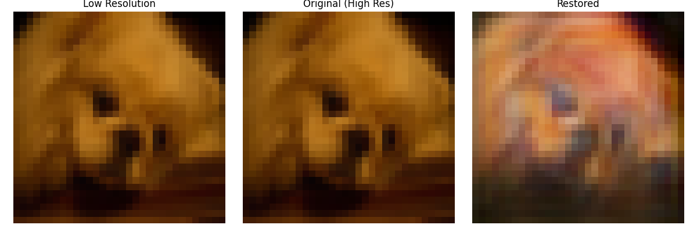
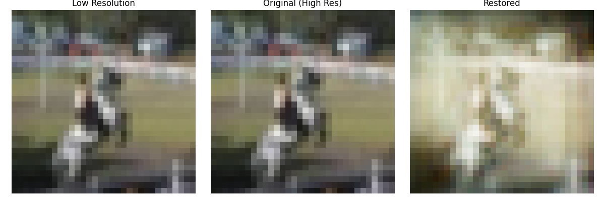

### **Епоха 3**
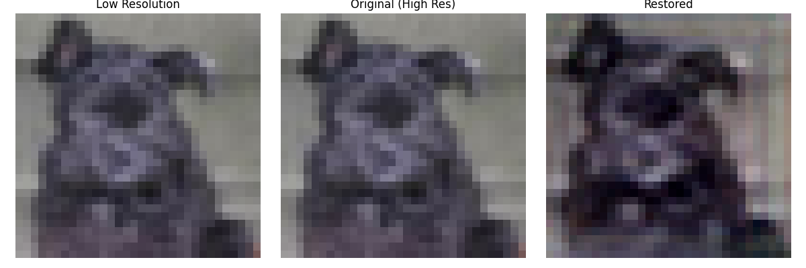
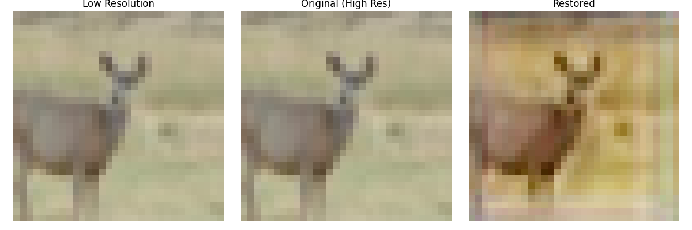

### **Епоха 4**
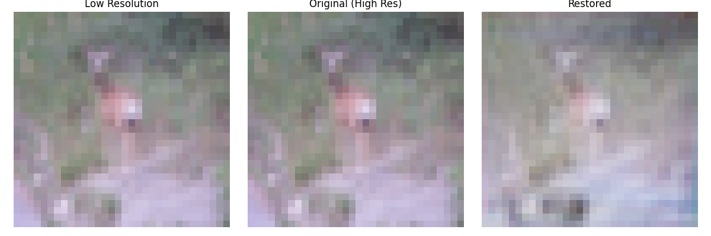
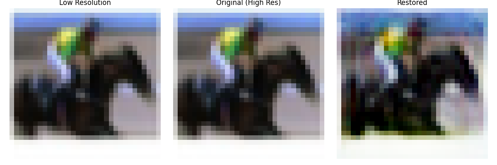

### **Епоха 5**
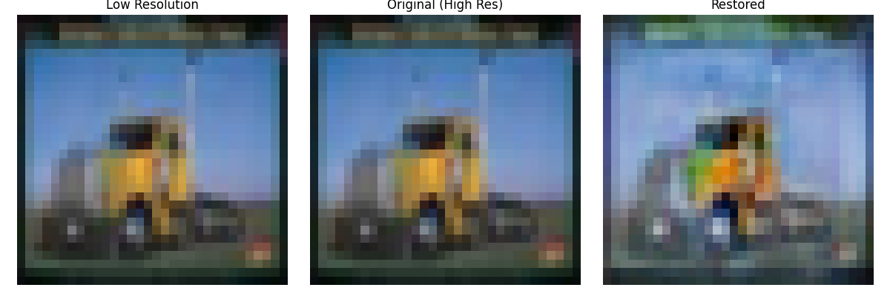
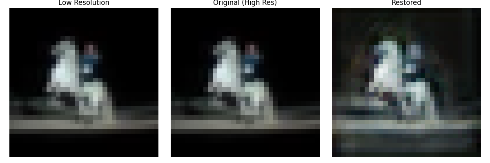

### **Епоха 6**
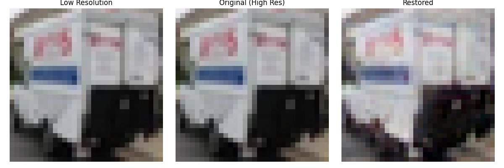
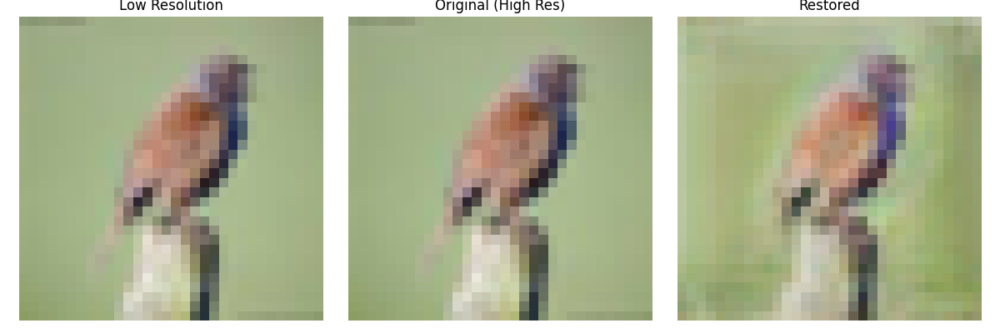

### **Епоха 7**
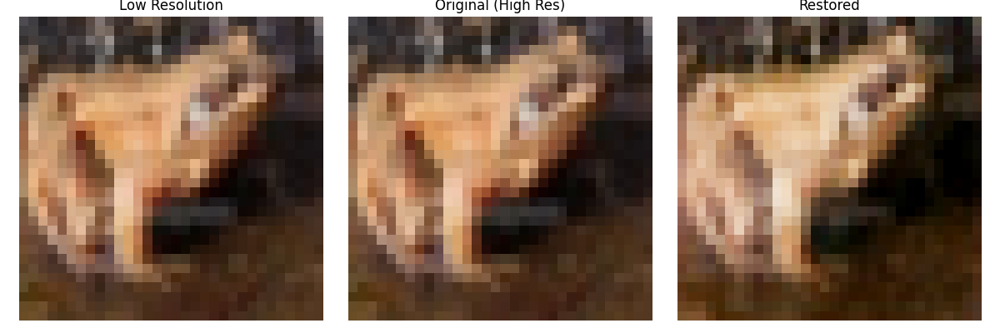
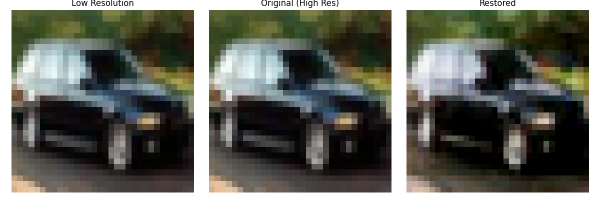

### **Епоха 8**
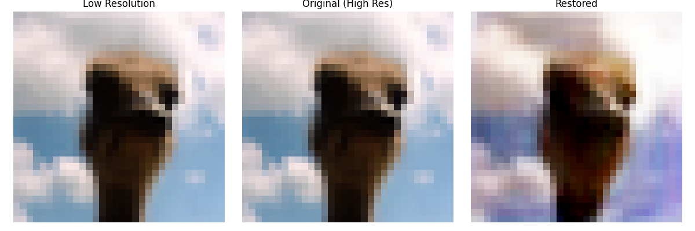
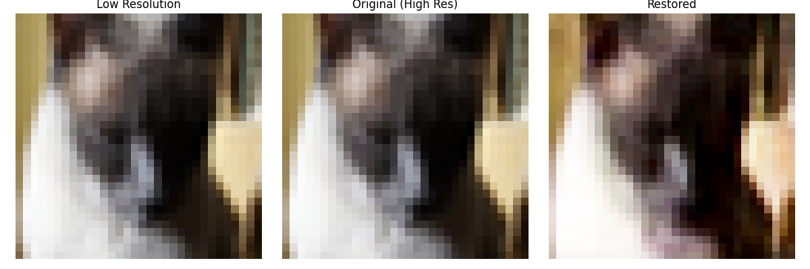

### **Епоха 9**
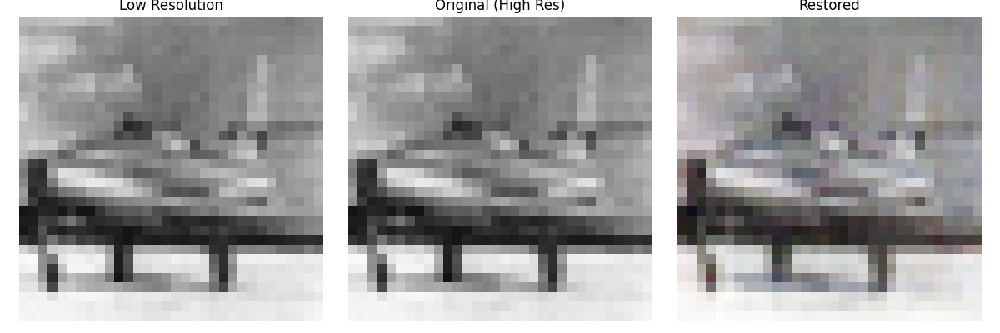
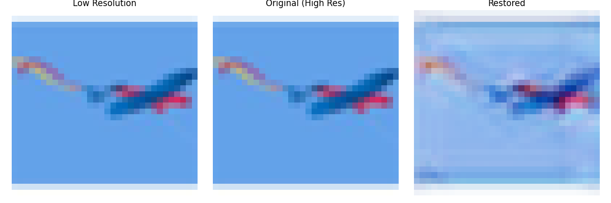

### **Епоха 10**
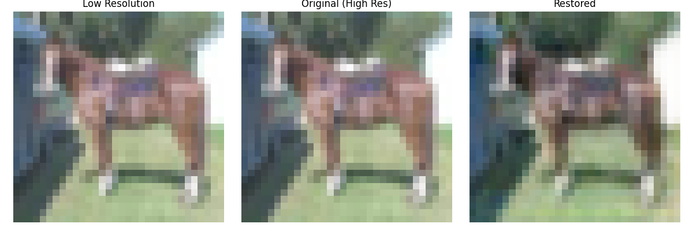
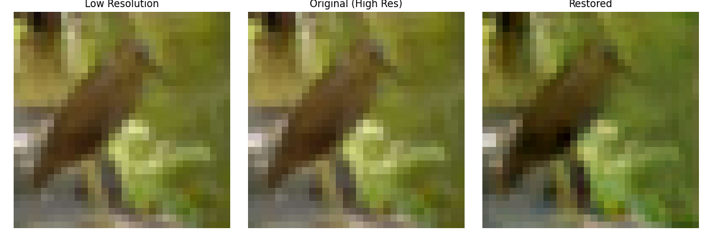


---

## **Підсумки**


1. **GAN**:
   - Добре справляється з відновленням загальної структури зображення.
   - Має обмежену деталізацію, особливо для складних текстур.

2. **SRGAN**:
   - Забезпечує кращу деталізацію завдяки спеціалізованій архітектурі.
   - Вимагає більше ресурсів для тренування.

3. **Метрики покращуються з епохами**:
   - На початку тренування (епохи 1-3) значення PSNR і SSIM низькі.
   - До 7-9 епохи моделі демонструють стабільне зростання PSNR і високі значення SSIM.
   
4. **Оптимальна якість**:
   - Найвищі значення PSNR (**23.6007**) і SSIM (**0.9459**) були досягнуті на 9-й епосі.

5. **Візуальне порівняння**:
   - На зображеннях видно суттєвий прогрес у відновленні деталей із кожною наступною епохою.

Результати підтверджують ефективність моделі у відновленні зображень із низької роздільної здатності.


## Висновок

Робота виконана згідно з поставленими цілями:

Реалізовано GAN для задачі відновлення зображень.
Проведено оцінку ефективності через PSNR та SSIM.

---

# Встановлення та запуск

## Створення та активація середовища

```
./setup_env.sh
source ./_env/bin/activate 
```

## 1. Встановлення необхідних бібліотек

```
pip install torch torchvision matplotlib gdown scikit-image
```

## Запуск тренування:
```
python train.py --dataset_path ./data --epochs 50 --batch_size 16

```


#### Оцінка лише GAN:

```
python train.py --dataset_path ./data --epochs 50 --batch_size 16 --resize 32


```

#### Оцінка GAN і SRGAN:

```
python evaluate.py --model_dir checkpoints --dataset_path ./data --batch_size 16 --max_images 5
```